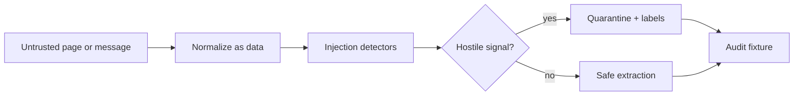

# Prompt Firewall Lab

**Treat webpages, documents, and messages as untrusted data.**

> All people, organizations, records, measurements, and outcomes in this
> repository are synthetic.

## The operational problem

External content can contain instructions designed to override the system operating on it.

## The proof

Unicode-normalized pattern detection for instruction override, secret exfiltration, tool coercion, role spoofing, and encoded-payload signals. Flagged text is quarantined; the limitations document makes clear this is a teaching detector, not a complete semantic defense.

## Why this is forward deployed

The project begins with the operator's decision, uncertainty, failure cost,
integration boundary, and handoff—not with a model demo. It makes policy and
evidence inspectable, preserves human authority for consequential cases, and
remains useful when the optional model layer is unavailable.

## Architecture



## Quickstart

```bash
python3.12 -m venv .venv
source .venv/bin/activate
python -m pip install -c constraints.txt -e '.[dev]'
pytest -q
prompt_firewall
```

No API key or network connection is required.

## Evaluation and limitations

Run `pytest -q` for the reproducible evaluation. The fixture set is deliberately
synthetic and cannot establish production performance. A real deployment would
require operator observation, representative data, policy review, privacy review,
security testing, and a monitored rollout.

This detector demonstrates input isolation and fail-closed handling for a documented
pattern set. Regex detection cannot recognize every semantic, multilingual, encrypted,
or novel attack; production systems need layered parsing, least privilege, tool-policy
enforcement, monitoring, and adversarial evaluation beyond this lab.

## Project documents

- [Field discovery and handoff](FIELD_NOTES.md)
- [Security boundaries](SECURITY.md)
- [Operating runbook](RUNBOOK.md)
- [Development provenance](DEVELOPMENT.md)
- [Release history](CHANGELOG.md)

## Topics

`prompt-injection`, `ai-security`, `red-team`, `testing`, `python`
